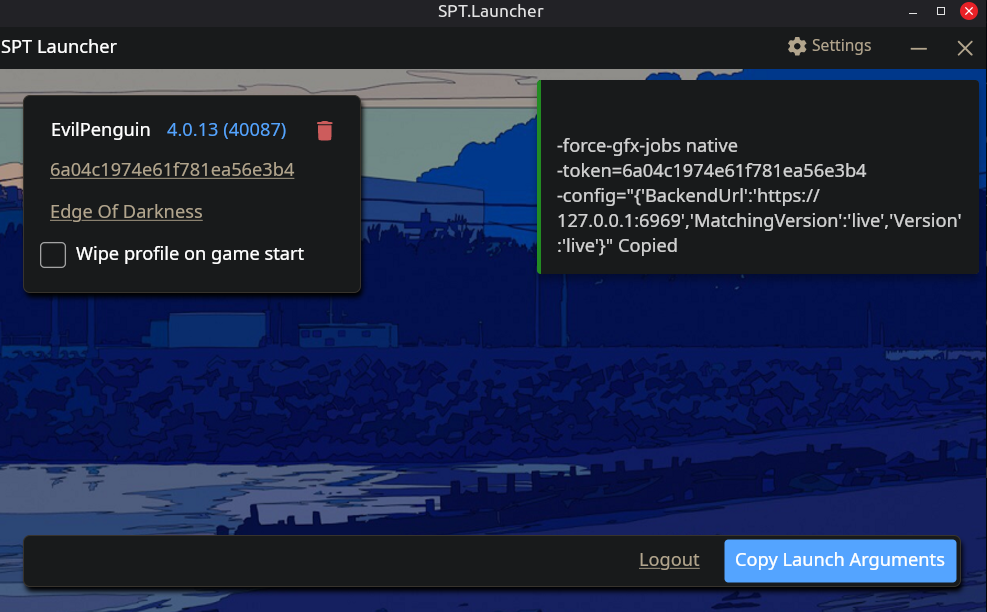

## A Linux build/fork of the original [SPT.Launcher](https://github.com/sp-tarkov/launcher)

This Linux "Launcher" ironically won't actually start your game. It is more like an account manager for your SPT (or Fika) accounts.

It is identical to the official one with the only difference being that instead of having a "Start Game" button it has a "Copy Launch Arguments" one. You will paste those arguments in your preferred launcher (Lutris/Heroic/Steam) and run your game with Proton.

**THIS IS ONLY THE LAUNCHER, NOT THE PATCHER OR INSTALLER!!!** To install SPT I recommend using a Windows virtual machine. Yes, I know of the Lutris install scripts but I had big trouble using them :(

If you want to try out the Lutris scripts then check out [SPT-Linux-Guide](https://github.com/MadByteDE/SPT-Linux-Guide).

## Download

Go to the [Releases](https://github.com/ThunderArtist/spt-launcher-linux/releases) page and download `SPT.Launcher.Linux-*.tar.gz`

## Requirements

- ASP.NET 9 Core Runtime ([how to install?](https://learn.microsoft.com/en-us/dotnet/core/install))
    * Check if you have it available in your package manager
    * (Linux Mint 22.3) I had to add it manually with an ubuntu PPA
    * 		sudo add-apt-repository ppa:dotnet/backports
    * 		sudo apt-get update && sudo apt-get install -y aspnetcore-runtime-9.0
- An SPT install - [GUIDE on how to install and set up SPT by using a Windows virtual machine](./spt-linux-guide-vm.md)
- A third-party launcher to start your game with (Lutris/Heroic/Steam)
- A runner (Proton/ProtonGE) to emulate the game with

## How to use

- Start the SPT server. SPT has a native Linux server included `SPT/SPT.Server.Linux` (requires .NET 9 runtime). Mark it as executable and launch it through Terminal to see it
- Start `SPT.Launcher.Linux`
- Create/login to an account
- Press "Copy Launch Arguments"
- Paste them into the launch arguments dialog inside your launcher of choice.
- To change the account playing you just select the account you want and copy-paste the launch arguments again.

## What the launch arguments mean

These are what the launcher on Windows is starting your game with. On Linux you'll be doing this manually because of emulation/proton setup.

- This always gets passed by the launcher, it should improve multi-core performance `-force-gfx-jobs native`
- The account you'll log in with `-token=accountnumber`
- The server you're connecting to (by default this should be the same) `-config="{'BackendUrl':'https://127.0.0.1:6969','MatchingVersion':'live','Version':'live'}"`

Example: `-force-gfx-jobs native -token=69fea3e381250c03c4e6f36a -config="{'BackendUrl':'https://127.0.0.1:6969','MatchingVersion':'live','Version':'live'}"`

## Contents

**Project**        | **Function**
------------------ | --------------------------------------------
SPT.Build          | Build script
SPT.ByteBanger     | Assembly-CSharp.dll patcher
SPT.Launcher       | Launcher frontend
SPT.Launcher.Base  | Launcher backend

## Privacy
SPT is an open source project. Your commit credentials as author of a commit will be visible by anyone. Please make sure you understand this before submitting a PR.
Feel free to use a "fake" username and email on your commits by using the following commands:
```bash
git config --local user.name "USERNAME"
git config --local user.email "USERNAME@SOMETHING.com"
```

## Build requirements

- Bash
- .NET 9 SDK
- A rich text editor (VSCodium)
- Open `project/SPT.Build` directory in Terminal
- Run `dotnet publish SPT.Build.Linux.csproj`
- Build results are stored in `project/Build.Linux`

## Server Endpoints

If you just want to mess with the server endpoints, you can use this [postman collection](https://gofile.io/d/kCzmze)

## Thank you to the SPT developers and maintainers <3

Thank you for creating and maintaining the SPT project. The modding community is lovely and the open source culture is awesome!

I've tried my best to keep this fork's changes separate from the original code so that it would be easy to merge. Feel free to contact me if you need assistance merging this with your official repo :)